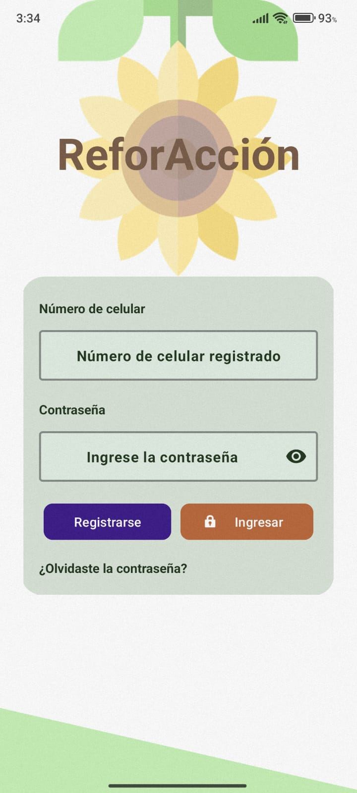
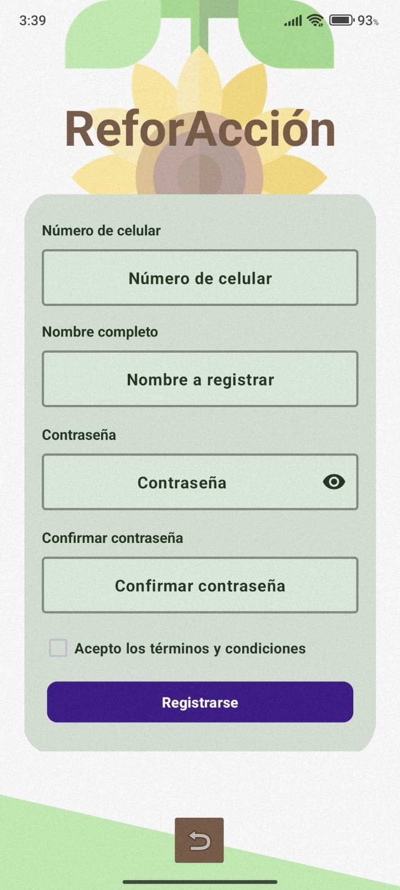
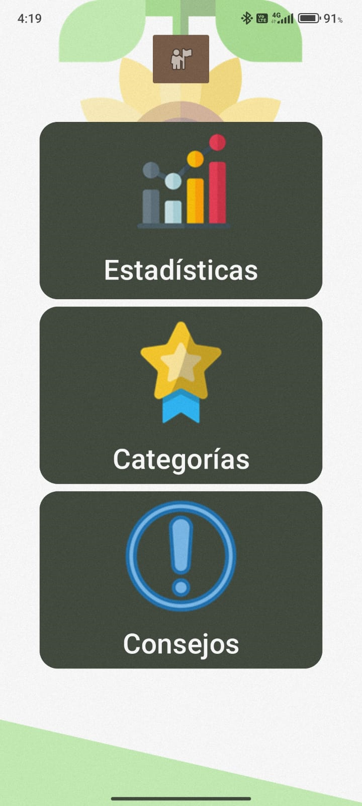
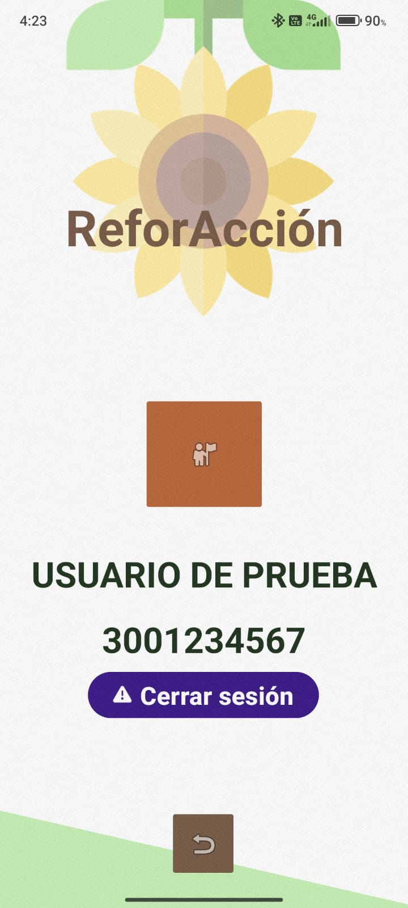
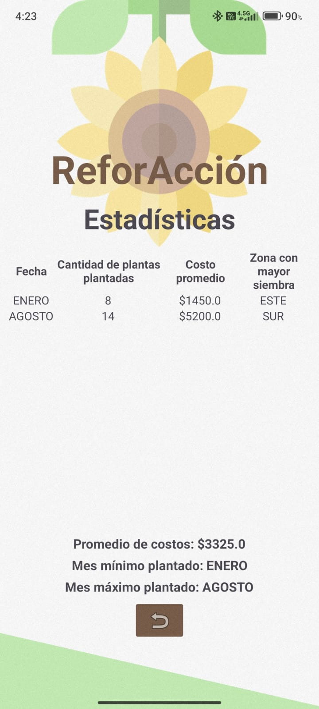
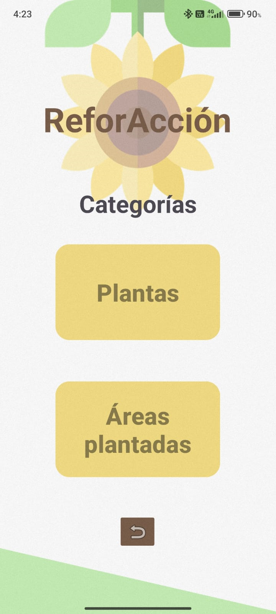
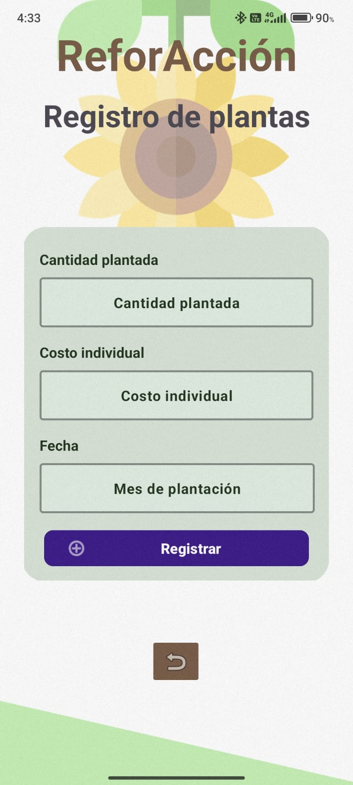
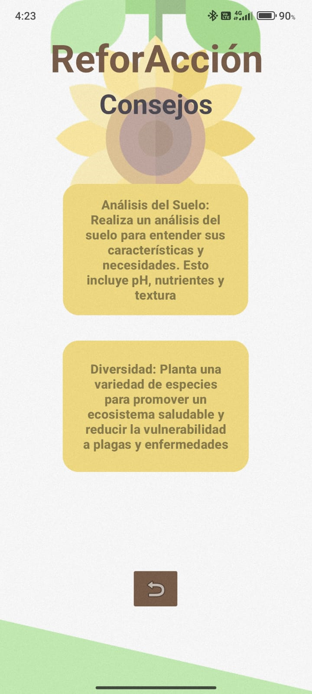

# ReforAcción

Aplicación móvil hecha en Java, conectada a Firestore, que permite llevar un registro y control de plantas y áreas plantadas durante los meses del año. A continuación se realizará una descripción de las pantallas y funcionalidades. 
Durante todo el ciclo de vida de la aplicación, se maneja la información del usuario activo una vez inicia sesión haciendo uso del modelo UserApplication, el cual es una clase que extiende a Application y cuyo atributo es uno de tipo User. Se puede ver su uso cuando en cada Actividad se obtiene el usuario actual de la siguiente forma.

`currentUser = (UserApplication) getApplicationContext;`

## Página de login

Esta página permite ingresar con unas credenciales existentes dentro de la base de datos de usuarios de Firebase. La llave única de cada documento es el **número de celular** con formato colombiano de diez dígitos. Se realizan validaciones desde el backend para que ambos campos tengan información. Se encripta la contraseña ingresada y se la compara con la que existe en base de datos.
Unas credenciales existentes de prueba que pueden utilizarse son: 
- **Número de celular: 3001234567**
- **Contraseña: 12345678**
También puede redirigir a la pantalla de registro.

## Página de registro

Esta página permite registrarse con un número de celular no existente dentro de la base de datos de usuarios de Firebase. La llave única de cada documento es el **número de celular** con formato colombiano de diez dígitos. Se realizan validaciones desde el backend para que todos los campos tengan información. Se encripta la contraseña ingresada y se guarda de esa forma en la base de datos.
Si se realiza el registro con éxito se redirige al usuario a la pantalla de login para que ingrese a la aplicación.
Los tipos de datos para cada campo son:
- **Número de celular: String**
- **Contraseña: String**
- **Nombre: String**
- **Términos: Boolean**
Al mismo tiempo, cada usuario se crea con dos campos de tipo array donde se guardarán posteriormente su información de plantación:
- **Areas: Array**
- **Plants: Array**

## Página principal

Desde esta página se puede acceder a las demás secciones: información de usuario, estadísticas, categorías y consejos.

## Página de información de usuario

Esta página permite ver (no cambiar) la información del usuario con sección activa en ese momento, además de permitirle cerrar la sesión.

## Página de estadísticas

Esta página consta de una tabla donde pueden visualizarse las estadísticas agrupadas por mes. Se implementa una lógica donde se consultan todos los elementos de los campos "areas" y "plants" de cada usuario, se manejan como un objeto ayudándose de los modelos, se agrupan y se calculan sus respectivas estadísticas.
En la parte de abajo de pueden visualizar tres textos con estadísticas relacionadas a toda la tabla. No se pueden modificar directamente estos datos, pues son calculados con la información consultada desde la basde de datos

## Página de categorías

Esta página permite al usuario escoger a qué categoría quiere registrar datos.

## Página de registro de plantas

En esta página se realiza el registro de plantas plantadas, desde el backend se realizan validaciones para que los campos no estén vacíos y contengan información pertinente. Al ingresar datos válidos, se crea un objeto de tipo Plant (creado por el modelo con el mismo nombre), y se añade como item al array "plants" del usuario con la sesión activa en ese momento.
Los tipos de datos y ejemplos de datos válidos son:
- **Cantidad plantada (Integer):** 5
- **Costo individual (Double):** 5200
- **Mes de plantación (String):** ENERO
En el caso de mes de plantación, se valida que se ingrese un mes del año. Cuando se registran datos de manera exitosa se redirige al usuario a la página principal.

## Página de registro de áreas plantadas

En esta página se realiza el registro de áreas plantadas, desde el backend se realizan validaciones para que los campos no estén vacíos y contengan información pertinente. Al ingresar datos válidos, se crea un objeto de tipo Area (creado por el modelo con el mismo nombre), y se añade como item al array "areas" del usuario con la sesión activa en ese momento.
Los tipos de datos y ejemplos de datos válidos son:
- **Zona plantada (String):** NORTE
- **Área en metros cuadrados (Double):** 5
- **Mes de plantación (String):** ENERO
  En el caso de mes de plantación, se valida que se ingrese un mes del año. Cuando se registran datos de manera exitosa se redirige al usuario a la página principal.

## Página de consejos

Esta página muestra al usuario dos consejos relacionados a las actividades de reforestación, los cuales se consultan de una colección en base de datos, consulta de la que se escogen dos consejos al azar para mostrar.

